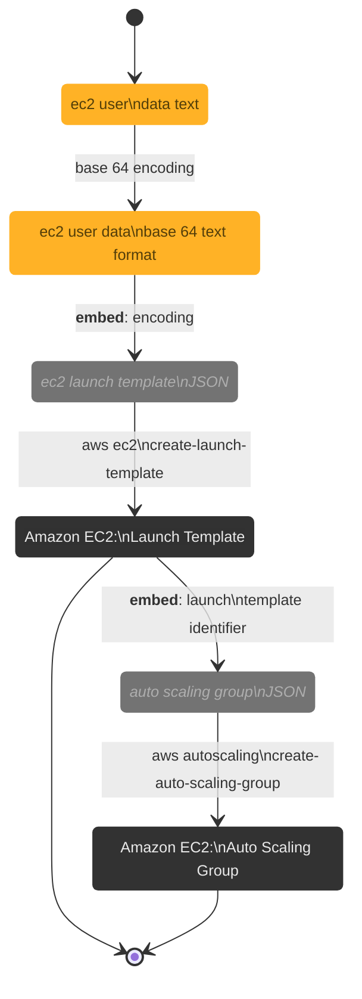

<br>

### Notes

* [Launch a GPU container instance for Amazon ECS](https://docs.aws.amazon.com/AmazonECS/latest/developerguide/gpu-launch.html)
  * [Amazon ECS-optimized Linux AMIs](https://docs.aws.amazon.com/AmazonECS/latest/developerguide/ecs-optimized_AMI.html)
  * [create-launch-template](https://awscli.amazonaws.com/v2/documentation/api/latest/reference/ec2/create-launch-template.html), [Create an Amazon EC2 launch template](https://docs.aws.amazon.com/AWSEC2/latest/UserGuide/create-launch-template.html#create-launch-template-define-parameters)
  * [delete-launch-template](https://docs.aws.amazon.com/cli/latest/reference/ec2/delete-launch-template.html)
  * [run-instances](https://awscli.amazonaws.com/v2/documentation/api/latest/reference/ec2/run-instances.html)
  * [Run commands when you launch an EC2 instance with user data input](https://docs.aws.amazon.com/AWSEC2/latest/UserGuide/user-data.html)

* [Auto Scaling](https://docs.aws.amazon.com/autoscaling/)
  * [create-auto-scaling-group](https://awscli.amazonaws.com/v2/documentation/api/latest/reference/autoscaling/create-auto-scaling-group.html)
  * aws autoscaling delete-auto-scaling-group --auto-scaling-group-name {auto.scaling.group.name}

<br>

### Testing

**Foremost**:

* define.json
* aws ec2 create-launch-template --cli-input-json file://src/core/ec2/define.json
* launch.json &larr; the launch template identifier of the previous step
* data.txt
  * echo ECS_CLUSTER="GraphicsCluster" >> /etc/ecs/ecs.config;
  * echo ECS_ENABLE_GPU_SUPPORT=true >> /etc/ecs/ecs.config
* aws ec2 run-instances --user-data $path/ec2/data.txt --cli-input-json $path/ec2/launch.json

<br>

<a href="https://docs.aws.amazon.com/AWSEC2/latest/UserGuide/connect-linux-inst-ssh.html" target="_blank"><b>Connecting</b></a>:

If an EC2 (Elastic Cloud Compute) Instance, the instance user name is usually `ec2-user`

```shell
chmod 400 {key.pair.name}
ssh -i /path/{key.pair.name} {instance.user.name}@instance-public-dns-name
```

Prior to testing a ECR (Elastice Container Registry) image container, within a private repository, login

```shell
aws ecr get-login-password --region {region.code} | docker login --username AWS \
     --password-stdin {aws.account.identifier}.dkr.ecr.{region.code}.amazonaws.com
```

<br>

**Beware**:

* [huggingface.co environment variables](https://huggingface.co/docs/huggingface_hub/main/en/package_reference/environment_variables)
* [aws configure](https://thereferences.github.io/practice/docs/build/html/development/integration/cloud.html)


<br>

### Steps

> [!NOTE]
> In Progress

<details><summary><b>Steps</b></summary>



</details>

<br>
<br>

<br>
<br>

<br>
<br>

<br>
<br>
