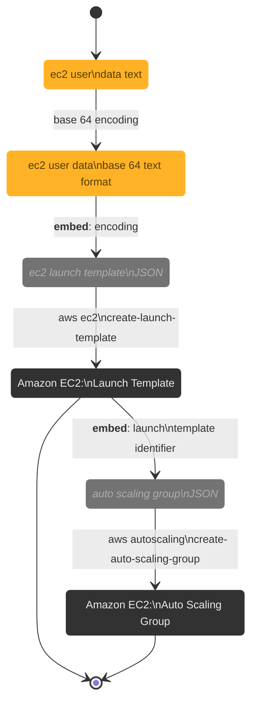

<br>

## Computation Settings for the Core Hyperparameter Search Module<br>Via Auto Scaling Capacity Provider

### Steps

<details><summary><b>Initial Steps</b></summary>



</details>

<br>

### Task Definition

At this stage?

```json
{
  "containerDefinitions": [
    {
      "command": ["...", "..."]
    }
  ]
}
```

<br>
<br>

<br>
<br>

<br>
<br>

<br>
<br>