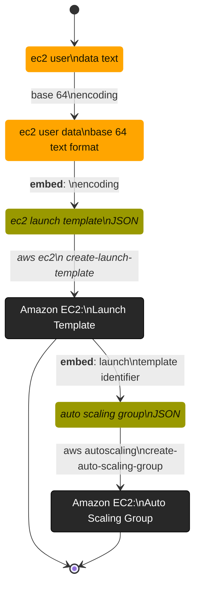

 

### Notes

* [Launch a GPU container instance for Amazon ECS](https://docs.aws.amazon.com/AmazonECS/latest/developerguide/gpu-launch.html)
  * [Amazon ECS-optimized Linux AMIs](https://docs.aws.amazon.com/AmazonECS/latest/developerguide/ecs-optimized_AMI.html)
  * [create-launch-template](https://awscli.amazonaws.com/v2/documentation/api/latest/reference/ec2/create-launch-template.html), [Create an Amazon EC2 launch template](https://docs.aws.amazon.com/AWSEC2/latest/UserGuide/create-launch-template.html#create-launch-template-define-parameters)
  * [delete-launch-template](https://docs.aws.amazon.com/cli/latest/reference/ec2/delete-launch-template.html)
  * [run-instances](https://awscli.amazonaws.com/v2/documentation/api/latest/reference/ec2/run-instances.html)
  * [Run commands when you launch an EC2 instance with user data input](https://docs.aws.amazon.com/AWSEC2/latest/UserGuide/user-data.html)

* [Auto Scaling](https://docs.aws.amazon.com/autoscaling/)
  * [create-auto-scaling-group](https://awscli.amazonaws.com/v2/documentation/api/latest/reference/autoscaling/create-auto-scaling-group.html)

 

### Steps

 
 

 
 

 
 

 
 
