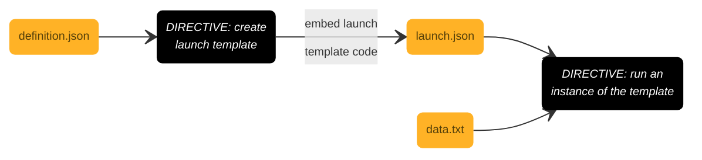

<br>

## Test Environment (Graphics Processing Unit)

### Creating



<br>

In brief:

* A definition.json encodes the template details for EC2 (Elastic Cloud Compute) instance launching. 
* The directive `aws ec2 create-launch-template --cli-input-json file://src/core/ec2/definition.json --region {region}` creates a template.
* The template has an identification code, this code is embed in a launch.json.
     ```json
     {
          "LaunchTemplate": {
               "LaunchTemplateId": "...",
               "Version": "$Latest"
          }
    }
    ```
* A `data.txt` script encodes custome launch time directives.[^user-data]
* The directive `aws ec2 run-instances --user-data $path/ec2/data.txt --cli-input-json $path/ec2/launch.json --region {region}` runs an instance of the template.

<br>

### Connecting

To <a href="https://docs.aws.amazon.com/AWSEC2/latest/UserGuide/connect-linux-inst-ssh.html" target="_blank">connect</a> to an EC2 (Elastic Compute Cloud) instance via a Key Pair

```shell
chmod 400 {key.pair.name}
ssh -i /path/{key.pair.name} {instance.user.name}@instance-public-dns-name
```

The instance user name is usually `ec2-user`.  Subsequently, explore elastic container registry images.  For example, prior to exploring/testing an ECR (Elastic Container Registry) image container **of a private repository**, login, then pull & run:

```shell
aws ecr get-login-password --region {region.code} | sudo docker login --username AWS \ 
     --password-stdin {aws.account.identifier}.dkr.ecr.{region.code}.amazonaws.com
sudo docker pull \
     {aws.account.identifier}.dkr.ecr.{region.code}.amazonaws.com/{repository.name}:{image.tag}
sudo docker run \
     {aws.account.identifier}.dkr.ecr.{region.code}.amazonaws.com/{repository.name}:{image.tag}
```

The `sudo` key might not be required if an EC2 machine is launched with a *user data file* that ensures docker usage without `sudo`, therefore

```shell
aws ecr get-login-password --region {region.code} | docker login --username AWS \
    --password-stdin {aws.account.identifier}.dkr.ecr.{region.code}.amazonaws.com
docker pull \
     {aws.account.identifier}.dkr.ecr.{region.code}.amazonaws.com/{repository.name}:{tag.name}
docker run \
     {aws.account.identifier}.dkr.ecr.{region.code}.amazonaws.com/{repository.name}:{tag.name}
```

For a graphics processing unit dependent run, a directive akin to

```shell
sudo docker run --rm --gpus all --shm-size=16gb -e AWS_DEFAULT_REGION={region}
     {aws.account.identifier}.dkr.ecr.{region}.amazonaws.com/{repository}:{tag}
```

might be required.

* export AWS_DEFAULT_REGION={region}
* export AWS_REGION={region}

<br>

### References

* [create-launch-template](https://awscli.amazonaws.com/v2/documentation/api/latest/reference/ec2/create-launch-template.html), [Create an Amazon EC2 launch template](https://docs.aws.amazon.com/AWSEC2/latest/UserGuide/create-launch-template.html#create-launch-template-define-parameters)
* [delete-launch-template](https://docs.aws.amazon.com/cli/latest/reference/ec2/delete-launch-template.html)
* [run-instances](https://awscli.amazonaws.com/v2/documentation/api/latest/reference/ec2/run-instances.html)
* [aws configure](https://thereferences.github.io/practice/docs/build/html/development/integration/cloud.html)
* [Amazon EC2, Docker Containers, Credentials](https://www.baeldung.com/ops/docker-container-pass-aws-credentials)

<br>
<br>

<br>
<br>

<br>
<br>

<br>
<br>


[^user-data]: [Run commands when you launch an EC2 instance with user data input](https://docs.aws.amazon.com/AWSEC2/latest/UserGuide/user-data.html)
